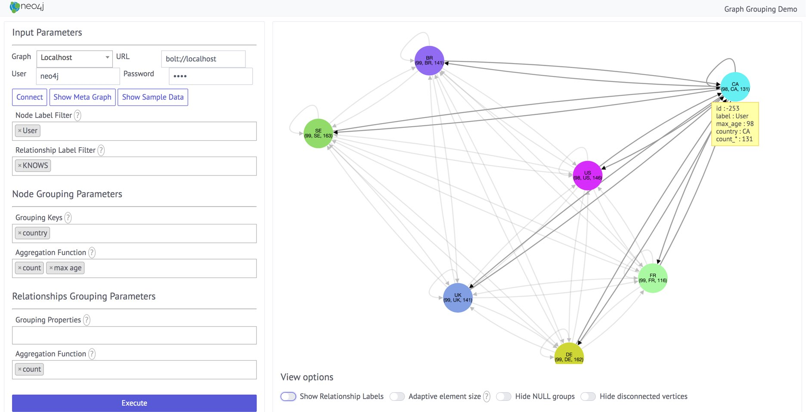

== Neo4j Graph Grouping Demo

Based on work by http://twitter.com/kc1s[Martin Junghanns] and Max Kiessling for the https://github.com/dbs-leipzig/gradoop_demo#graph-grouping[Gradoop Demo].

Uses the user defined procedure `apoc.group.nodes` to compute the grouping.

Run it live here: https://rawgit.com/neo4j-examples/neo4j-grouping/master/index.html[Grouping Demo]

You can select:

* the database connection
* labels to be used in grouping (default all)
* relationship-types to be used (default all)
* properties to group by
* aggregation operations for nodes and relationships, by default either are counted

=== Libraries used

* Neo4j Javascript Driver
* Cytoscape with Dagre for Visualization
* jquery, select2 and spectre for UI

=== License

Apache License v2